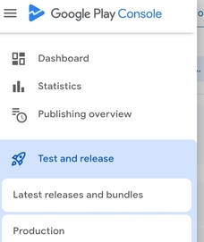
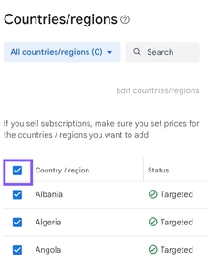
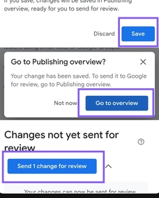

# Testogethr Android SDK Showcase

[](https://github.com/Moozart/testogethr-sdk-android/stargazers)
[](https://github.com/Moozart/testogethr-sdk-android/releases/latest)

Public Android showcase repository for Testogethr SDK integration, release tracking, and issue intake.

## What Testogethr Does

Testogethr helps mobile teams validate campaign flows with real users and measurable milestones.

With the SDK, you can:

- Start and bind test sessions from deep links
- Register declared events for milestone tracking
- Track campaign/test events consistently across app flows
- Verify completion data in a structured way during closed tests

## Integrate Faster with AI

Use the official docs AI-assisted quick start:

- AI-assisted intro and setup: <https://docs.testogethr.com/docs/intro>
- Full integration guide (deep links, schema, tracking): <https://docs.testogethr.com/docs/usage>

You can copy the AI prompt from docs and generate project-specific integration steps in minutes.

## In-App Preview

<p align="center">
  
  
  
</p>

## Repository Scope

This repository is for:

- Android SDK integration documentation
- Public release and tag visibility
- Integrator issue tracking and support routing

This repository does **not** include Testogethr SDK source code. SDK source remains private.

## Quick Links

- Android integration guide: [docs/android.md](docs/android.md)
- iOS integration guide: [docs/ios.md](docs/ios.md)
- Docs homepage: <https://docs.testogethr.com>
- AI-assisted quick start: <https://docs.testogethr.com/docs/intro>
- iOS SwiftPM repository: <https://github.com/Moozart/testogethr-sdk-ios-spm>
- Changelog: [CHANGELOG.md](CHANGELOG.md)
- Latest Android release: <https://github.com/Moozart/testogethr-sdk-android/releases/latest>
- Open an issue: <https://github.com/Moozart/testogethr-sdk-android/issues>

## SDK Access Token (Required)

You must generate the SDK access token from the **Testogethr mobile app**:

1. Open Testogethr app
2. Go to **Profile**
3. Open **API Key Manager**
4. Generate and copy your SDK token

> Critical: SDK initialization will fail without a valid token from **Profile -> API Key Manager**.

## Download Testogethr App

- Android (Google Play): <https://play.google.com/store/apps/details?id=com.testogethr.app>
- iOS (App Store): <https://apps.apple.com/>

## Installation

### Android (Maven)

```kotlin
dependencies {
    implementation("com.testogethr:sdk:<version>")
}
```

Replace `<version>` with the latest stable release from the release badge above.

### iOS (Swift Package Manager)

Use the Swift package repository URL:

`https://github.com/Moozart/testogethr-sdk-ios-spm`

Then select the release version you want.
Use the **Latest release** badge in that repository to choose the current stable tag.

## Android Integration Quick Start

### 1) Initialize SDK

Initialize early (typically in `Application.onCreate`).

```kotlin
import android.app.Application
import android.util.Log
import com.testogethr.sdk.TestogethrConfig
import com.testogethr.sdk.TestogethrSdk

class MyApplication : Application() {
    override fun onCreate() {
        super.onCreate()

        TestogethrSdk.initialize(
            sdkAccessToken = "YOUR_SDK_ACCESS_TOKEN",
            config = TestogethrConfig(applicationContext),
            debugLogger = { level, tag, message, throwable ->
                Log.d("Testogethr", "[$level] $tag: $message", throwable)
            }
        )
    }
}
```

### 2) Configure deep link and start session

Add an intent filter:

```xml
<activity android:name=".MainActivity" ...>
    <intent-filter>
        <action android:name="android.intent.action.VIEW" />
        <category android:name="android.intent.category.DEFAULT" />
        <category android:name="android.intent.category.BROWSABLE" />
        <data android:scheme="${applicationId}" android:host="testogethr" />
    </intent-filter>
</activity>
```

Extract `sessionToken` and start session:

```kotlin
private fun handleIntent(intent: Intent?) {
    val sessionToken = intent?.data?.getQueryParameter("sessionToken")
    if (sessionToken != null) {
        TestogethrSdk.get().startSession(sessionToken)
    }
}
```

### 3) Register schema

```kotlin
import com.testogethr.sdk.TestogethrSdk
import com.testogethr.shared.models.api.sdk.DeclaredEvent

val bossEvent = DeclaredEvent(
    name = "boss_defeated",
    description = "Fired when the final alien boss is beaten"
)

TestogethrSdk.get().registerSchema(
    isDiscoveryMode = true,
    events = listOf(bossEvent)
)
```

### 4) Track events

```kotlin
TestogethrSdk.get().trackEvent(event = bossEvent)
```

You can also track by name:

```kotlin
TestogethrSdk.get().trackEvent(eventName = "boss_defeated")
```

## iOS Integration Reference

For full iOS integration:

- iOS quick guide in this repo: [docs/ios.md](docs/ios.md)
- iOS distribution repo (SwiftPM): <https://github.com/Moozart/testogethr-sdk-ios-spm>

## Release and Version Policy

- Public versions are tagged as `vMAJOR.MINOR.PATCH`
- Every release should include:
  - Git tag
  - GitHub Release notes
  - Updated integration docs when API behavior changes

## Support

- Bug reports: use the Bug Report issue template
- Feature requests: use the Feature Request issue template
- Security disclosures: see [`.github/SUPPORT.md`](.github/SUPPORT.md)
